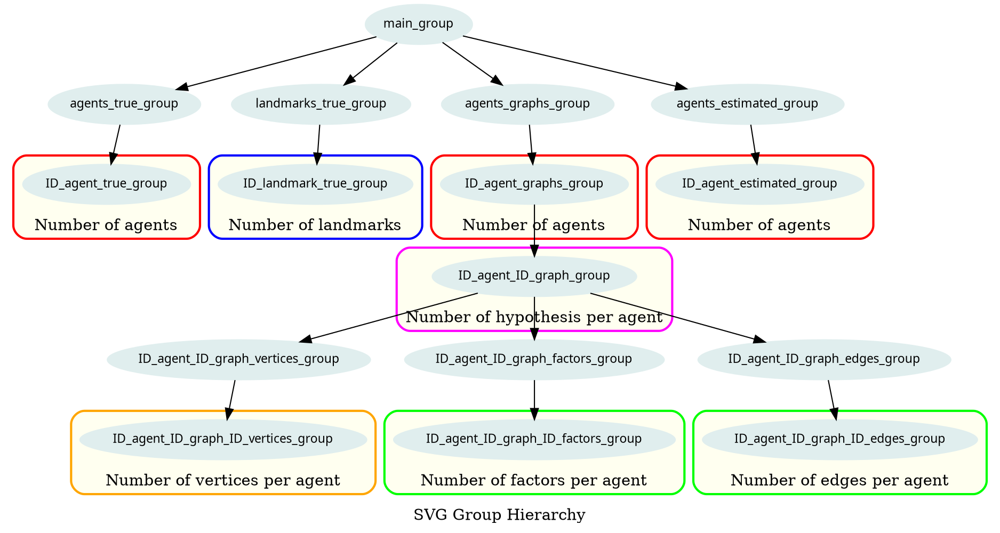

# SVG Groups

## Main Canvas : graph

At the root, we find the svg tag of class _canvas_. Then, the tree is :

- `main_group` as an svg group
  - `agents_true_group` the robots, the real ones (if GT available)!
    - For each robot: `id_robot_true_group` whose descendants are the graphical
      components. Also the sensor coverage !
      **Class list**: `agent` `[selected]`
  - `landmarks_true_group` are the landmarks (if GT available)
    - For each landmark : `id_landmark_true_group` that contains simply a circle.
      **Class list**: `landmark`
  - `agents_estimated_group` the robots as estimated
    - For each robot: `id_robot_estimated_group` whose descendants are the graphical
      components.
  - `landmark_estimated_group` are the landmarks estimated positions (not used
    for now).
  - `graphs` : subdivided (depth) in two groups
    - `id_robot_graphs` : has a classlist of `[selected]`, as one robot can maintain
      several hypothesis (in nonlinear context):
      - For each graph: `id_robot_id_graph_group`: class `main_hypothesis` which is composed of:
        - `factors_group`
          - `id_factors_group` (TODO: deal with factors sharing the same vertices set)
        - `edges_group`
          - `id_edges_group` : containing a line
        - `vertices_group`
          - `id_vertex_group` : contains a circle, and a cov ellipse. A tooltip
            (selection.on('mouseover') to be defined)
- `axes_group` (to be defined)

Ideas :

- Which groups should have `.on('mouseover')` tooltips ?

